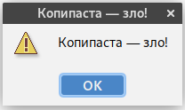

# Anti-CopyPaster task

Author: Dmitrii Abramov.

This plugin shows alert message when user pastes text to the editor:

This plugin is based on code of another my plugin for __Partial Extract Method Refactoring__ task. For the most technical details see https://github.com/karvozavr/ast-info-plugin.

## Usage

The easiest way to run the plugin is:  
`./gradlew runIde`

To display AST for selection:

1. Select some code in editor.
2. Press `AST Info` button under `AST Info` button.
3. Tool Window with AST and statistics will appear.
4. To see info for another code fragment: GOTO 1.

## Implemntation details 

### AST by selection 

https://github.com/karvozavr/ast-info-plugin

### Copypaste alert message 

Alert message is created using Messages API of Intellij platform. 

Paste event processing is implemented by extending Intellij extension point `CopyPastePreProcessor`.
